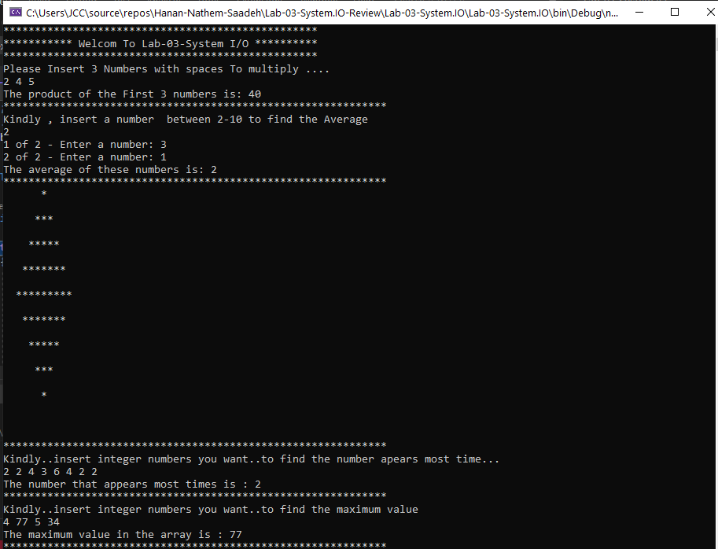
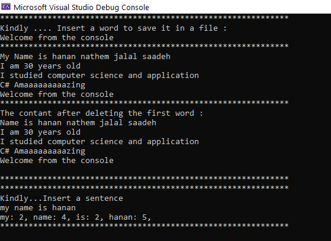
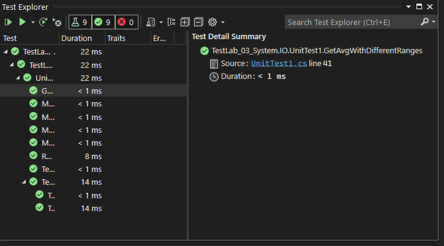
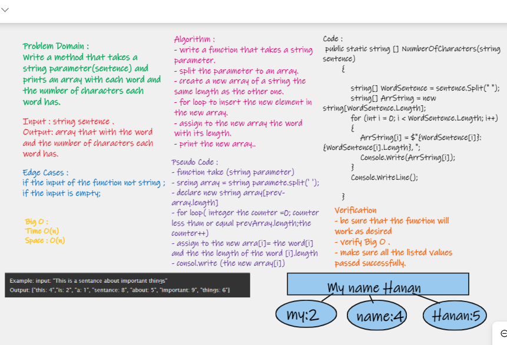

# Lab-03-System.IO-Review

**Author**: Hanan Nathem Jalal Saadeh
**Version**: 1.0.0 

## Overview
This is a program that contains a 9 challenges about c# Practicing and System.IO

## Getting Started
- clone the project.
- open the project in VS(Visual Stodio)
- run the program (F5)
- Note that we have 2 projects one for the 9 Challenges and the other for the test Challenges.

## Example

---

## TestUnit

## Whiteboard Proces for challenge 9

